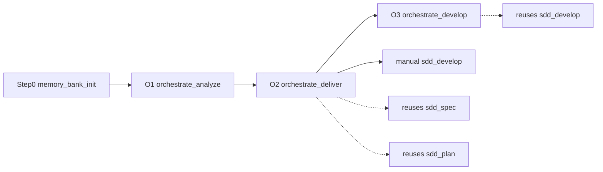

# antigravity-dev-toolkit

Personal Antigravity IDE plugin toolkit for disciplined software execution: gate-first skills, SDD Formas A/B/C (`features/NNN-slug/`), strong guardrails, and Git developer workflows. **Public** — clone and fork freely; **no upstream contributions** (see [CONTRIBUTING.md](CONTRIBUTING.md)).

## What this is

| Capability | Description |
|------------|-------------|
| **Formas A / B / C** | Classic SDD, backlog prep, orchestrated multi-story (memory-bank + `orchestrate_*`) |
| **Manifest v2** | Classic storage (`repository` or `global`) under `~/.gemini/antigravity-ide/sdd/` |
| **Validation** | Unified smoke test (`validate-all.ps1`) — deploy, docs, structure, language |
| **Enforcement** | `GUARDRAILS.md` + KI injection + SESSION gates (no native hooks) |
| **36 skills** | Underscore names under `plugin/skills/` (includes `dev_persona` router) |

## Quick start

From repo root, use the toolkit CLI:

**Windows (PowerShell):**

```powershell
.\scripts\toolkit.ps1
```

**macOS / Linux (requires [PowerShell 7+](https://learn.microsoft.com/powershell/scripting/install/installing-powershell)):**

```bash
./scripts/toolkit.sh
```

Full deploy details: **[docs/INSTALL.md](docs/INSTALL.md)**. Other scripts (`sync-antigravity`, `validate-all`, `configure-repo-sdd`) live there.

Register a consumer repo for Classic SDD:

```powershell
.\scripts\configure-repo-sdd.ps1 -StorageMode repository -RepoPath "D:\Source\Repos\MyApp"
```

## Workflows

| Forma | When | Pipeline |
|-------|------|----------|
| **A** Classic | One clear feature | `sdd_spec` -> `sdd_plan` -> `sdd_develop` |
| **B** Backlog | Rough bug/story first | `refine_story` -> `split_story_checklist` -> A or C |
| **C** Orchestrated | Multi-story / brownfield | Step 0 `memory_bank_init` -> `orchestrate_analyze` -> `orchestrate_deliver` -> `orchestrate_develop` \| `sdd_develop` |

Canonical artifact root: `features/NNN-slug/` (see `plugin/skills/_shared/sdd_artifacts/STORAGE.md`).

### Forma C (orchestration)

Orchestrators do **not** replace `sdd_*`; they **invoke the same contracts**:



| Stage | Skill | What it does |
|-------|-------|----------------|
| Step 0 | `memory_bank_init` | Healthy `memory-bank/` gate (required for C; not for A) |
| O1 | `orchestrate_analyze` | Triage, optional specialists, US/TS backlog + CONTINUITY |
| O2 | `orchestrate_deliver` | PRD + PLAN **per story** via `sdd_spec` / `sdd_plan` contracts |
| O3 | `orchestrate_develop` | One PLAN step per session via `sdd_develop` contract (or run `sdd_develop` yourself) |

Daily hub: [docs/guides/README.md](docs/guides/README.md). Forma C manual: [docs/guides/10-forma-c-orquestracao.md](docs/guides/10-forma-c-orquestracao.md).

**Breaking:** Spec Kit (`speckit_*`) and root flat `PRD/` / `PLAN/` flows are removed. Migrate to Formas A/C.

## Repository layout

```
antigravity-dev-toolkit/
├── .github/               # workflows/, PULL_REQUEST_TEMPLATE.md
├── AGENTS.md
├── CONTRIBUTING.md
├── README.md
├── docs/                  # INSTALL, guides/, SKILLS, REPO_GOVERNANCE, PORTABILITY
├── scripts/               # toolkit(.ps1|.sh), sync-antigravity, configure-repo-sdd
│   ├── validation/
│   └── maintainers/
└── plugin/
    ├── plugin.json
    ├── GUARDRAILS.md
    └── skills/            # 36 skills + _shared (underscore names)
```

## Skills (after sync)

| Skill | Use for |
|-------|---------|
| `sdd_spec` | PRD from a feature request |
| `sdd_plan` | Baby-step PLAN from PRD |
| `sdd_develop` | One PLAN step per session |
| `memory_bank_init` | Forma C Step 0 - create/refresh `memory-bank/` |
| `orchestrate_analyze` | Forma C O1 - multi-story analyze / backlog |
| `orchestrate_deliver` | Forma C O2 - PRD/PLAN per story |
| `orchestrate_develop` | Forma C O3 - one PLAN step per session |
| `dev_persona` | Central AG router (language, git, catalog) |
| `developer` | Stack router for small tasks |
| `code_review` | Review diff or branch vs PRD/PLAN |
| `commit` | Conventional commit |
| `push` | Safe git push after confirmation |
| `impeccable` | UI design; shape -> DESIGN-BRIEF |
| `blip_plugin_developer` | New Blip React plugin scaffold |
| `dotnet_developer` | Small .NET work without full SDD |
| `blazor_developer` | Small Blazor UI work |
| `react_developer` | Small React work |
| `react_native_developer` | Small React Native / Expo work |
| `angular_developer` | Small Angular work |
| `vue_developer` | Small Vue 3 work |
| `electron_developer` | Small Electron desktop work |
| `javascript_developer` | Small Node/JS work |
| `python_developer` | Small Python work |
| `ef_add_migration` | EF Core migration in the open repo |
| `repair_dotnet_build` | Fix build/test failures |
| `test_coverage` | .NET coverage report |
| `document_plan` | Plan repo documentation (RAG-oriented) |
| `document_implement` | Execute one doc plan step |
| `refine_story` | Refine bug/story + quality scorecard |
| `split_story_checklist` | Implementation task checklist |
| `scaffold_message_handler` | Scaffold message handler (MassTransit/RMQ default) |
| `refactor` | Safe incremental refactoring |
| `api_integrate` | Typed clients from OpenAPI |
| `performance_profile` | Profiling and hot-path optimization |
| `containerize` | Dockerfiles and compose |
| `i18n_manager` | Extract strings to localization files |

Canonical details: [docs/SKILLS.md](docs/SKILLS.md).

## Docs

- [AGENTS.md](AGENTS.md) — guardrails contract
- [docs/SKILLS.md](docs/SKILLS.md) — skill catalog (36)
- [docs/guides/](docs/guides/) — user guides (incl. Forma C 10–12)
- [docs/INSTALL.md](docs/INSTALL.md) — install / sync (Win + Unix)
- [docs/REPO_GOVERNANCE.md](docs/REPO_GOVERNANCE.md) — public policy + maintainer rulesets
- [CONTRIBUTING.md](CONTRIBUTING.md) — clone/fork OK; no community PRs
- [docs/ENFORCEMENT.md](docs/ENFORCEMENT.md) — enforcement model
- [docs/PORTABILITY.md](docs/PORTABILITY.md) — IDE-specific vs reusable
- [docs/DESIGN-DECISIONS.md](docs/DESIGN-DECISIONS.md) — design rationale

## Maintainer notes

1. Chat replies: pt-BR. Skill sources and production code: English.
2. Skill folders use underscores (`sdd_spec`).
3. Respect one-step-per-session in `sdd_develop`, Forma C O3, and `document_implement`.
4. Never auto-run mutating git; confirm with `sim`.
5. This repo does not accept community PRs — see [CONTRIBUTING.md](CONTRIBUTING.md).

## License

[MIT](LICENSE) © 2026 Raphael Campos. See [CONTRIBUTING.md](CONTRIBUTING.md) for contribution policy (clone/fork OK; no community PRs).
