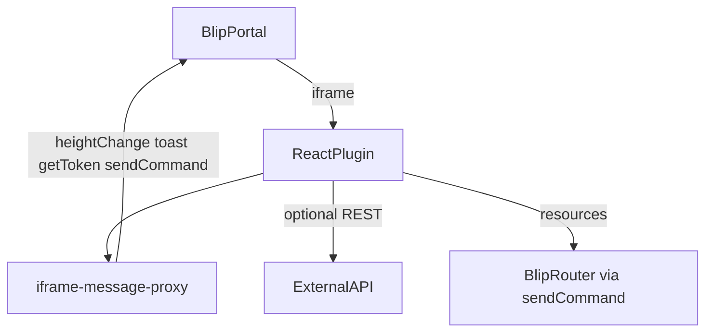

# Blip plugin integration (antigravity-dev-toolkit)

Official scaffold: [create-blip-extension](https://github.com/heloineto/create-blip-extension) via `npm create blip-extension@latest`. Alternative: a **user-provided** template URL/path. Do not invent org-only internal templates. **Not** `cra-template-blip-plugin` (microbundle) as default.

## Three levels (do not confuse)

| Level | What | Project install? |
|-------|------|------------------|
| **1 - Toolkit skill** | `use skill blip_plugin_developer` + lazy-loaded `blip_guidelines/` | **No** - synced via `sync-antigravity.ps1` |
| **2 - Scaffold** | `npm create blip-extension@latest` + `npm run config:plugin` | **Yes** - in the target plugin repo |
| **3 - Portal registration** | Blip portal advanced settings -> Plugins JSON + local URL | **Yes** - manual, never commit keys |

Daily scaffold -> spec -> implement **does not** require a separate SDK install beyond npm dependencies.

## Invoke

```
use skill blip_plugin_developer
```

For implementation in an existing Blip plugin repo, use `use skill react_developer` (auto-loads `blip_guidelines/` when `blip-ds` is in `package.json`).

## Architecture overview

Blip plugins are React web apps rendered inside an iframe in the Blip portal. Communication with the parent portal uses `iframe-message-proxy` (and optionally the `blip-iframe` facade).



There is **no SDK manifest in code** - plugin registration is external (portal JSON + deployed URL).

## Complexity profiles

Choose by **technical criteria** only:

| Profile | When to use |
|---------|-------------|
| **Lite** | Single page/route, no auth wrapper, BDS web components, direct HTTP or simple Blip resources |
| **Full** | Multi-route CRUD, `AuthProvider`, JWT + buckets, `blip-ds-react` (or wrappers), segment tracking as needed |

Ask the user which profile during scaffold (Phase 1 of the skill).

## Post-scaffold checklist

After `npm create blip-extension@latest` (or user-provided template):

```powershell
cd <plugin-name>
npm install
npm run config:plugin   # replaces PLUGIN_NAME in charts/ and appsettings
npm run build           # smoke: must pass before handoff
```

Then:

1. **Portal Blip** - register plugin URL (local `http://localhost:3000` for dev) in advanced settings -> Plugins JSON
2. **Segment prefix** - verify `config/appsettings.json` -> `segment.prefix` matches plugin name
3. **API URL** - set `config/appsettings.json` -> `api.url` and `api.key` (never commit real keys)
4. **i18n** - confirm `assets/locales/{en,es,pt}/` exist and default language matches portal
5. **Manual smoke** - run `npm start`, open inside Blip portal, verify iframe height and toast
6. **CI** - detect existing pipeline (see `deploy-and-ci.md`); do not assume Azure Pipelines

## Handoff contract

1. `blip_plugin_developer` Phase 1 -> scaffold + profile choice
2. Phase 2 -> `sdd_spec` -> `sdd_plan` -> `sdd_develop` **or** Forma C (`orchestrate_*`) **or** existing PRD/brief
3. Phase 3:
   - Net-new UI -> `use skill impeccable shape` -> `docs/DESIGN-BRIEF.md` (`target_stack: react`, Blip notes in section 9). See [impeccable-integration.md](impeccable-integration.md).
   - Implementation -> `use skill react_developer` (loads `blip_guidelines/`)
   - Backend API (.NET) -> `use skill dotnet_developer` in a **separate repo**

One session = one phase or one SDD step. Do not scaffold and implement in the same session.

## Anti-patterns (REST / scaffold)

Do not treat any single corporate sample plugin as a template. Prefer these corrections:

| Anti-pattern | Correct approach |
|--------------|------------------|
| Scaffold from `cra-template-blip-plugin` (microbundle) | Use `npm create blip-extension@latest` (CRA + react-scripts) or a URL the user provides |
| Skip `npm run config:plugin` | Always run; replaces `PLUGIN_NAME` in charts and appsettings |
| Two component trees (`src/component/` + `src/components/`) | Single tree under `src/` matching template layout |
| Treat raw `response.data` as the domain payload | Unwrap the API envelope your contract defines (often `response.data.value`) |
| Guess auth scheme (`Bearer` vs `Key` vs cookie) | Match OpenAPI / backend contract; document in one client module |
| Hardcode display labels that disagree with API enums/locales | Map enum/display strings in a constants module |
| Silent `catch` returning `[]` | Surface auth/API errors via Toast |
| Missing factory/service files referenced in imports | Scaffold services before UI that imports them |
| Delete CI/charts blindly when present | Detect existing CI; customize, do not remove blindly |

## Generic REST client checklist

Before marking a feature complete, verify the UI has client coverage for each backend route it calls:

| Concern | Pattern |
|---------|---------|
| List / search | Paginated GET with query params; unwrap items + total |
| Detail | GET by id |
| Mutations | POST/PUT/PATCH/DELETE with clear success/error Toast |
| Auth failures | Handle 401/403 explicitly (re-auth or unauthorized UI) |
| Retries | Idempotent GETs may retry with backoff; mutations only when safe |
| Headers | Centralize auth + content-type + correlation id |

See `external-api-integration.md` for envelopes, auth, and error handling.

## Guidelines bundle

Lazy-loaded from `plugin/skills/_shared/blip_guidelines/`:

| File | Topic |
|------|-------|
| `plugin-architecture.md` | Setup, routing, iframe, i18n, Cypress |
| `design-system.md` | blip-ds, blip-ds-react, Tailwind, Nunito |
| `blip-iframe-messages.md` | toast, modal, heightChange, segment |
| `auth-and-permissions.md` | getToken, buckets, AuthProvider (Full) |
| `external-api-integration.md` | REST envelopes, headers, errors, retry |
| `deploy-and-ci.md` | charts, CI detection, Dockerfile, config:plugin |

## Sync policy

`blip_plugin_developer` and `blip_guidelines/` live in this toolkit and deploy via `sync-antigravity.ps1`.

## Validation

```powershell
.\scripts\validation\validate-blip-plugin-skill.ps1
```

Bundled with `validate-all.ps1`.

## Wrong templates (do not use as default)

| Template | Why avoid |
|----------|-----------|
| `cra-template-blip-plugin` (microbundle npm) | Library structure, not CRA extension; often missing charts/pipeline |
| Any unsolicited internal template clone | Use official `npm create blip-extension@latest` or a URL the user explicitly provides |
