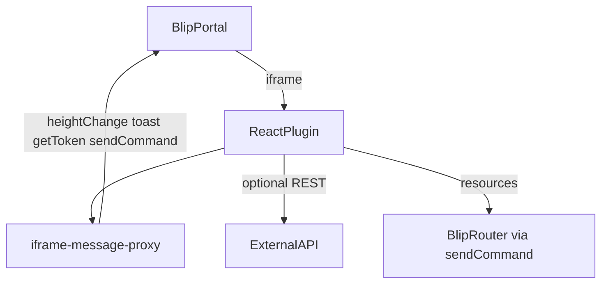

# Blip plugin integration (antigravity-dev-toolkit)

Official scaffold: [create-blip-extension](https://github.com/heloineto/create-blip-extension) via `npm create blip-extension@latest`. **Not** `cra-template-blip-plugin` (microbundle) or silent ADO template clone as default.

Reference production plugins:

- **Full profile:** `blip-stellantis-plugin` - multi-route CRUD, `AuthProvider`, buckets, `blip-ds-react`
- **Lite profile:** `blip-na-produtization` - single page, no auth, direct proxy, BDS web components

## Three levels (do not confuse)

| Level | What | Project install? |
|-------|------|------------------|
| **1 - Toolkit skill** | `use skill blip_plugin_developer` + lazy-loaded `blip_guidelines/` | **No** - synced via `sync-antigravity.ps1` |
| **2 - Scaffold** | `npm create blip-extension@latest` + `npm run config:plugin` | **Yes** - in the target plugin repo |
| **3 - Portal registration** | Blip portal advanced settings -> Plugins JSON + local URL | **Yes** - manual, never commit keys |

Daily scaffold -> spec -> implement **does not** require a separate SDK install beyond npm dependencies.

## Invoke

```
use skill blip_plugin_developer
```

For implementation in an existing Blip plugin repo, use `use skill react_developer` (auto-loads `blip_guidelines/` when `blip-ds` is in `package.json`).

## Architecture overview

Blip plugins are React web apps rendered inside an iframe in the Blip portal. Communication with the parent portal uses `iframe-message-proxy` (and optionally the `blip-iframe` facade).



There is **no SDK manifest in code** - plugin registration is external (portal JSON + deployed URL).

## Complexity profiles

| Profile | Reference | When to use |
|---------|-----------|-------------|
| **Lite** | `blip-na-produtization` | Single page, no auth, BDS web components, direct HTTP or simple resources |
| **Full** | `blip-stellantis-plugin` | Multi-route CRUD, `AuthProvider`, JWT buckets, `blip-ds-react`, segment tracking |

Ask the user which profile during scaffold (Phase 1 of the skill).

## Post-scaffold checklist

After `npm create blip-extension@latest`:

```powershell
cd <plugin-name>
npm install
npm run config:plugin   # replaces PLUGIN_NAME in charts/ and appsettings
npm run build           # smoke: must pass before handoff
```

Then:

1. **Portal Blip** - register plugin URL (local `http://localhost:3000` for dev) in advanced settings -> Plugins JSON
2. **Segment prefix** - verify `config/appsettings.json` -> `segment.prefix` matches plugin name
3. **API URL** - set `config/appsettings.json` -> `api.url` and `api.key` (never commit real keys)
4. **i18n** - confirm `assets/locales/{en,es,pt}/` exist and default language matches portal
5. **Manual smoke** - run `npm start`, open inside Blip portal, verify iframe height and toast

## Handoff contract

1. `blip_plugin_developer` Phase 1 -> scaffold + profile choice
2. Phase 2 -> `sdd_spec` -> `sdd_plan` -> `sdd_develop` **or** Forma C (`orchestrate_*`) **or** existing PRD/brief
3. Phase 3:
   - Net-new UI -> `use skill impeccable shape` -> `docs/DESIGN-BRIEF.md` (`target_stack: react`, Blip notes in section 9). See [impeccable-integration.md](impeccable-integration.md).
   - Implementation -> `use skill react_developer` (loads `blip_guidelines/`)
   - Backend API (.NET) -> `use skill dotnet_developer` in a **separate repo**

One session = one phase or one SDD step. Do not scaffold and implement in the same session.

## Anti-patterns (from `blip-stellantis-coupons`)

The coupons plugin is a documented **negative fixture** - do not use as a template.

| Anti-pattern | Correct approach |
|--------------|-------------------|
| Scaffold from `cra-template-blip-plugin` (microbundle) | Use `npm create blip-extension@latest` (CRA + react-scripts) |
| Skip `npm run config:plugin` | Always run; replaces `PLUGIN_NAME` in charts and appsettings |
| Two component trees (`src/component/` + `src/components/`) | Single tree under `src/` matching template layout |
| `response.data` on .NET `Result<T>` | Unwrap `response.data.value` (see `external-api-integration.md`) |
| Authorization header without `Key ` prefix | Use `Authorization: Key <token>` |
| English status labels (`Available`) vs API PT (`Disponível`) | Map API enum/display strings explicitly |
| Silent `catch` returning `[]` | Surface auth/API errors via Toast |
| Missing factory/service files referenced in imports | Scaffold services before UI that imports them |
| No charts/pipeline/Dockerfile | Keep template CI artifacts; customize, do not delete blindly |

## Guidelines bundle

Lazy-loaded from `plugin/skills/_shared/blip_guidelines/`:

| File | Topic |
|------|-------|
| `plugin-architecture.md` | Setup, routing, iframe, i18n, Cypress |
| `design-system.md` | blip-ds, blip-ds-react, Tailwind, Nunito |
| `blip-iframe-messages.md` | toast, modal, heightChange, segment |
| `auth-and-permissions.md` | getToken, buckets, AuthProvider (Full) |
| `external-api-integration.md` | Result&lt;T&gt;, headers, error handling |
| `deploy-and-ci.md` | charts, azure-pipelines, Dockerfile, config:plugin |

## Sync policy

`blip_plugin_developer` and `blip_guidelines/` are ported from **cursor-dev-toolkit** (authored there). Manual sync when cursor branch updates — not automated cross-repo.

## Validation

```powershell
.\scripts\validation\validate-blip-plugin-skill.ps1
```

Bundled with `validate-all.ps1`.

## Wrong templates (do not use as default)

| Template | Why avoid |
|----------|-----------|
| `cra-template-blip-plugin` (microbundle npm) | Library structure, not CRA extension; missing charts/pipeline |
| ADO `package-plugin-template` (internal) | May diverge from public CRA scaffold; optional internal path only with user confirmation |
