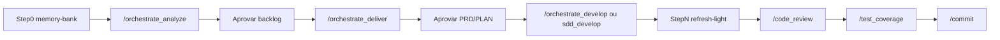

# Caso de uso Forma C: extração NuGet (brownfield)

**Índice:** [Guides README](README.md) · **Referência do fluxo:** [10 - Forma C](10-forma-c-orquestracao.md) · **Outro caso:** [12 - app mobile](12-forma-c-caso-mobile-app.md)

**Idioma:** pt-BR (guide de agente). Skills e identificadores permanecem em inglês.

Cenário ilustrativo — **não** exige app de produção neste repo. Serve para treinar o fluxo completo O1 → O2 → O3 (ou `sdd_develop`) com memory-bank, especialistas e pós-código.

---

## Objetivo

Extrair uma **integração / biblioteca compartilhada X** embutida em monorepo (ou copiada entre apps) para um **pacote NuGet interno**. Apps A e B passam a consumir o pacote **sem quebrar CI**.

### Por que Forma C (não A nem B)

| Sinal | Motivo |
|-------|--------|
| Multi-história | Pacote + publish CI + App A + App B (e opcional fluxo do dev) |
| Brownfield | Blast radius em código e pipelines existentes |
| Especialistas | `repo_analyst`, `architect`, `security` (feed/token/supply-chain) |
| Memory-bank | Mapa do repo alvo antes de cortar dependências |

Forma A (`sdd_spec` → …) basta se for **uma** história clara sem orquestração. Forma B só se o pedido ainda for informal demais para triage.

---

## Pré-requisitos

1. Toolkit sincronizado: `.\scripts\sync-cursor.ps1` ([Install](../INSTALL.md)).
2. Repositório **alvo** (o monorepo / apps A+B) aberto no Cursor, modo **Agent**.
3. Branch de feature válida (`feature/<slug>` ou `feat/<id>`).
4. Gates de sessão: confirmações **sim** nos pontos high-cost.

---

## Fluxo da jornada



---

## Chat 1 — Step 0 + O1 (`orchestrate_analyze`)

### Invoke

```text
use skill orchestrate_analyze

Pedido: Extrair a integração compartilhada X (hoje duplicada / embutida)
para um pacote NuGet interno. Apps A e B devem consumir o pacote
sem quebrar CI. Feed interno; tokens só em secrets do pipeline.
```

### Step 0 — Memory Bank Gate

| Situação no repo alvo | O que acontece |
|-----------------------|----------------|
| `memory-bank/` ausente | Agente pede **sim** → create (`memory_bank_init`) |
| Bank incompleto / stale | Pede **sim** → refresh |
| Bank saudável | Continua só com leitura seletiva (`fresh`) |

Path: `$Cwd/memory-bank/` (repository) ou `<classic.path>/memory-bank/` (global) — **nunca** sob `features/NNN-slug/`.

`CONTINUITY.md` guarda só path + status (`created` \| `refreshed` \| `fresh`).

### Triage esperada (exemplo)

| Campo | Valor |
|-------|--------|
| Nature | `brownfield` |
| Complexity | `complex` |
| Scope | `backend` |
| `needs_api` | `true` (contratos / superfície pública do pacote) |
| `needs_domain` | `true` (limites do que entra no pacote) |
| `needs_security` | `true` (feed-token, supply-chain) |
| `needs_devops` | `true` (publish CI) — nota em CONTINUITY; sem Task dedicado |
| `needs_frontend` / `needs_database` | `false` (salvo UI/persistência compartilhada) |

### Especialistas Task (paralelo, cap 4)

| Flag / regra | Especialista | Saída típica |
|--------------|--------------|--------------|
| Brownfield / blast radius | `repo_analyst` | Notas em `ANALYSIS/` ou síntese no FEATURE |
| Contratos do pacote | `architect` | Notas em `ARCH/` |
| Feed / secrets / supply-chain | `security` | Notas em `SEC/` |

O1 **não** escreve código de aplicação nem spawna `dotnet_developer`.

### Histórias de exemplo após síntese

| Story | Conteúdo |
|-------|----------|
| TS01 | Extrair projeto de pacote + versionamento + publish no feed / CI |
| TS02 | App A como consumidor (PackageReference, remoção do código embutido) |
| TS03 | App B como consumidor |
| US01 *(opcional)* | Fluxo de publish local para desenvolvedor (doc + script) |

### Artefatos gravados (após aprovação do backlog)

```text
features/004-nuget-extract/
├── FEATURE.md          # triage, needs_*, índice de stories, status draft→approved
├── CONTINUITY.md       # fase analyze, Memory-bank path+status, próximo invoke
├── TS01/STORY.md
├── TS02/STORY.md
├── TS03/STORY.md
└── US01/STORY.md       # se existir
```

Pastas opcionais sob cada story: `ANALYSIS/`, `ARCH/`, `SEC/`, `REFINE/`.

### Gate humano

Pare e aprove o backlog (**sim** / ajustar / cancelar). Só depois:

```text
use skill orchestrate_deliver - features/004-nuget-extract/
```

---

## Chat 2 — Step 0 + O2 (`orchestrate_deliver`)

### Step 0 de novo

No início da sessão O2 o gate roda outra vez. Bank `fresh` → sem reescrita.

### Modo série vs paralelo

| Modo | Quando |
|------|--------|
| **Paralelo** (recomendado aqui) | Várias TS independentes o bastante; cada filho **só rascunha** PRD/PLAN; pai agrega → **sim** → pai grava |
| **Série** | Dependência forte (ex.: TS02/TS03 só após contrato fechado de TS01) |

Neste cenário: rascunhar TS01–TS03 em paralelo; se TS02/TS03 dependerem do contrato público de TS01, o PLAN de TS02/TS03 deve listar dependência explícita (não implementar consumidor antes do pacote versionado).

### Artefatos por história (contratos `sdd_spec` / `sdd_plan`)

```text
features/004-nuget-extract/
├── TS01/
│   ├── STORY.md
│   ├── PRD/004_nuget_package.md
│   └── PLAN/PLAN_004_nuget_package.md
├── TS02/
│   ├── STORY.md
│   ├── PRD/004_app_a_consumer.md
│   └── PLAN/PLAN_004_app_a_consumer.md
└── …
```

### Handoff típico após aprovação

```text
## Handoff O2 → develop

Feature: features/004-nuget-extract/

| Story | PRD | PLAN |
|-------|-----|------|
| TS01 | features/004-nuget-extract/TS01/PRD/004_nuget_package.md | features/004-nuget-extract/TS01/PLAN/PLAN_004_nuget_package.md |
| TS02 | features/004-nuget-extract/TS02/PRD/004_app_a_consumer.md | features/004-nuget-extract/TS02/PLAN/PLAN_004_app_a_consumer.md |
| TS03 | features/004-nuget-extract/TS03/PRD/004_app_b_consumer.md | features/004-nuget-extract/TS03/PLAN/PLAN_004_app_b_consumer.md |

### Manual (1 step por sessão)
use skill sdd_develop - features/004-nuget-extract/TS01/PLAN/PLAN_004_nuget_package.md - Step 1

### Orquestrado (O3)
use skill orchestrate_develop - features/004-nuget-extract/
```

---

## Chat 3+ — Develop (O3 ou manual)

### Preferência de ordem

1. **TS01** até 100% (pacote + CI publish green).
2. **TS02**, depois **TS03** (consumidores).
3. **US01** se ainda fizer sentido.

### Opção A — O3

```text
use skill orchestrate_develop - features/004-nuget-extract/
```

| Regra | Detalhe |
|-------|---------|
| Pai | Atualiza `CONTINUITY.md`; **não** implementa |
| Filho | Um Task = um passo do PLAN (contrato `sdd_develop`) |
| Contexto do filho | Paths lean: PRD, STORY, CONTINUITY, FEATURE, `bank_path` (leitura seletiva) |
| Após cada step | Pare / confirme antes do próximo spawn |
| Stack | Implementação via contrato sdd_develop; `dotnet_developer` só se o PLAN / routing indicar atalho de stack — O1/O2 **não** spawnam stack agents |

### Opção B — Manual

Nova sessão por passo:

```text
use skill sdd_develop - features/004-nuget-extract/TS01/PLAN/PLAN_004_nuget_package.md - Step 1
```

Forma A manual **não** exige memory-bank; neste fluxo Forma C o bank já existe e continua útil como mapa.

### Step N — `refresh-light`

Quando pelo menos um filho O3 alterou código de aplicação, antes do handoff final de review:

1. Agente pede **sim** para atualizar o bank.
2. `memory_bank_init` modo **`refresh-light`** (inventário + GENERATED + `tech-stack.json`).
3. CONTINUITY: Memory-bank status → `refreshed` (ou nota de skip).

### Se o build/CI quebrar

```text
use skill fix_build
```

Depois retomar o próximo step ou reabrir o passo falho.

---

## Pós-código — review, coverage, commit

Ordem recomendada (por história concluída ou no fim da feature):

```text
use skill code_review
```

Passe `single` ou `multi-angle`, ou deixe a skill perguntar. Use PRD/PLAN da história ativa.

```text
use skill test_coverage
```

Projetos .NET com testes; limiar default 80%.

```text
use skill commit
```

Conventional commit na branch de feature (após **sim**). Push só se pedido: `use skill push`.

---

## Árvore final (exemplo)

```text
memory-bank/                          # local; gitignored em modo repository
features/004-nuget-extract/
├── FEATURE.md
├── CONTINUITY.md                     # fase review / done; próximo handoff
├── TS01/
│   ├── STORY.md
│   ├── ANALYSIS/ … ARCH/ … SEC/ …    # se gerados no O1
│   ├── PRD/
│   └── PLAN/                         # checkboxes dos steps marcados
├── TS02/ …
└── TS03/ …
```

Código da lib e PackageReference ficam no **repo alvo** (não sob `features/`).

---

## Checklist — capacidades usadas neste caso

| Capacidade | Onde aparece |
|------------|--------------|
| Memory Bank Gate (Step 0) | Início O1 / O2 / O3 |
| Triage `needs_*` + ROSTER | O1 |
| Especialistas Task paralelos | `repo_analyst`, `architect`, `security` |
| `FEATURE.md` + US/TS + `CONTINUITY.md` | O1 |
| Gate humano backlog | Fim O1 |
| PRD/PLAN por história (série/paralelo) | O2 |
| Gate humano PRD/PLAN | Fim O2 |
| 1 step / subagente (O3) ou `use skill sdd_develop` | Develop |
| Step N `refresh-light` | Fim O3 com mudanças de código |
| `use skill code_review` · `use skill test_coverage` · `use skill commit` | Pós-código |
| `use skill fix_build` | Se CI/build falhar |

---

## Erros comuns (cenário NuGet)

| Erro | Correção |
|------|----------|
| Consumir pacote (TS02) antes de publicar versão (TS01) | Ordem de histórias + deps no PLAN |
| Token de feed no código-fonte | Security: só secrets de CI; `needs_security=true` |
| O3 pai implementando vários steps | Must-not; um filho / um step |
| Criar `memory-bank/` sob `features/` | Path errado — ver [10](10-forma-c-orquestracao.md#step-0--memory-bank-gate) |
| Usar Forma C para “só bump de versão” | Preferir `dotnet_developer` / `developer` |

---

## Relacionados

| Doc | Uso |
|-----|-----|
| [10-forma-c-orquestracao.md](10-forma-c-orquestracao.md) | Contrato O1/O2/O3 |
| [12-forma-c-caso-mobile-app.md](12-forma-c-caso-mobile-app.md) | Caso greenfield |
| [02b-dotnet_developer.md](02b-dotnet_developer.md) | Atalho .NET isolado |
| [03-code_review.md](03-code_review.md) | Review |
| [04-test_coverage.md](04-test_coverage.md) | Coverage |
| [05-operational-skills.md](05-operational-skills.md) | commit / fix_build |
