# Caso de uso Forma C: app mobile MAUI (greenfield)

**Índice:** [Guides README](README.md) · **Referência do fluxo:** [10 - Forma C](10-forma-c-orquestracao.md) · **Outro caso:** [11 - NuGet](11-forma-c-caso-nuget-extract.md)

**Idioma:** pt-BR (guide de agente). Skills e identificadores permanecem em inglês.

Cenário ilustrativo — **não** exige app de produção neste repo. Serve para treinar o fluxo completo do **conceito** à entrega com O1 → O2 → O3 (ou `sdd_develop`), memory-bank criado do zero, multi-US e pós-código.

---

## Objetivo

Construir um app **.NET MAUI** greenfield — exemplo de produto: **Diário de hábitos** — desde a ideia inicial até shell navegável, CRUD, lembretes e packaging/CI local.

Stack alinhada ao toolkit: implementação via contrato `sdd_develop` / O3, com routing para `dotnet_developer` quando o PLAN indicar atalho de stack. Não há skill nativa iOS/Android separada; MAUI cobre iOS/Android via .NET.

### Por que Forma C (não A nem B)

| Sinal | Motivo |
|-------|--------|
| Multi-história | Onboarding/shell + CRUD + notificações + CI/packaging |
| Greenfield complexo | Várias US, decisões de domínio e segurança desde o dia 1 |
| Especialistas | `architect`, `security`, `database` (persistência local) |
| Memory-bank | Step 0 **create** — banco nasce com o projeto |

Forma A basta para **uma** fatia clara (ex.: só CRUD). Forma B se o pedido ainda for nota solta de backlog.

---

## Pré-requisitos

1. Toolkit sincronizado: `.\scripts\sync-antigravity.ps1` ([Install](../INSTALL.md)).
2. Workspace do app (repo novo ou pasta vazia) aberto no Cursor, modo **Agent**.
3. Branch de feature válida quando houver git.
4. Confirmações **sim** nos gates high-cost.

---

## Fluxo da jornada

```mermaid
flowchart LR
  Concept[Conceito do produto] --> S0[Step0 create bank]
  S0 --> O1["/orchestrate_analyze"]
  O1 --> Gate1[Aprovar backlog]
  Gate1 --> O2["/orchestrate_deliver paralelo"]
  O2 --> Gate2[Aprovar PRD/PLAN]
  Gate2 --> O3["/orchestrate_develop"]
  O3 --> SN[StepN refresh-light]
  SN --> Rev["/code_review"]
  Rev --> Cov["/test_coverage"]
  Cov --> Commit["/commit"]
```



---

## Chat 1 — Step 0 + O1 (`orchestrate_analyze`)

### Invoke

```text
use skill orchestrate_analyze

Pedido: Criar app mobile .NET MAUI "Diário de hábitos" do zero.
MVP: onboarding + lista/CRUD de hábitos + lembretes locais.
Persistência local no dispositivo; sem backend na v1.
Auth local simples (ou biometria se o dispositivo permitir).
Incluir packaging/CI local para build MAUI.
```

### Step 0 — Memory Bank Gate (create)

Em greenfield típico o bank **não existe**:

1. Agente detecta ausência.
2. Pede **sim** → create (`use skill memory_bank_init` ou fluxo embutido).
3. CONTINUITY: Memory-bank status `created` + path.

Nas sessões O2/O3 seguintes: bank saudável → `fresh` (só leitura) até o Step N pós-código.

### Triage esperada (exemplo)

| Campo | Valor |
|-------|--------|
| Nature | `greenfield` |
| Complexity | `complex` |
| Scope | `fullstack` (UI MAUI + domínio + storage) ou `frontend` se só UI |
| `needs_frontend` | `true` — **sem** Task O1 de frontend; nota em CONTINUITY; routing na implementação |
| `needs_domain` | `true` |
| `needs_database` | `true` (SQLite / preferências locais) |
| `needs_security` | `true` (auth local / biometria / dados no device) |
| `needs_api` | `false` (v1 sem backend) |
| `needs_devops` | `true` — nota CONTINUITY (CI/packaging); sem Task dedicado |

### Especialistas Task (paralelo)

| Flag | Especialista | Nota |
|------|--------------|------|
| `needs_domain` | `architect` | Limites do MVP, camadas MAUI |
| `needs_database` | `database` | Modelo local, migrations/esquema |
| `needs_security` | `security` | Dados no device, biometria |
| Brownfield / repo legado | `repo_analyst` | **Não** spawnar se não há código legado relevante |

O1 **não** spawna `dotnet_developer` / stack agents. Stack entra no develop via `ROUTING.md` / PLAN.

### Histórias de exemplo

| Story | Conteúdo |
|-------|----------|
| US01 | Shell do app + onboarding (primeira execução) |
| US02 | CRUD de hábitos (lista, criar, editar, concluir o dia) |
| US03 | Lembretes / notificações locais |
| TS01 | CI local + packaging MAUI (build debug/release) |

### Artefatos após aprovação do backlog

```text
features/001-habit-diary/
├── FEATURE.md
├── CONTINUITY.md
├── US01/STORY.md
├── US02/STORY.md
├── US03/STORY.md
└── TS01/STORY.md
```

Opcional sob stories: `ARCH/`, `SEC/`, pastas de análise de database conforme especialistas.

### Gate humano

**sim** no backlog → handoff:

```text
use skill orchestrate_deliver - features/001-habit-diary/
```

---

## Chat 2 — Step 0 + O2 (`orchestrate_deliver`)

### Step 0

Gate no início da sessão. Bank já criado → em geral `fresh`.

### Modo paralelo (recomendado)

US01–US03 e TS01 podem ser rascunhadas em paralelo. Filhos **só rascunham**; pai agrega → aprovação humana → pai grava PRD/PLAN com contratos `sdd_spec` / `sdd_plan`.

Dependências típicas no PLAN:

- US02 depende de shell/navegação de US01.
- US03 depende de modelo de hábito (US02) para agendar lembretes.
- TS01 pode avançar em paralelo cedo (pipeline) e fechar no fim com o projeto real.

### Artefatos por história

```text
features/001-habit-diary/
├── US01/
│   ├── STORY.md
│   ├── PRD/001_onboarding_shell.md
│   └── PLAN/PLAN_001_onboarding_shell.md
├── US02/
│   ├── STORY.md
│   ├── PRD/001_habits_crud.md
│   └── PLAN/PLAN_001_habits_crud.md
├── US03/ …
└── TS01/ …
```

### Handoff típico

```text
## Handoff O2 → develop

Feature: features/001-habit-diary/

| Story | PRD | PLAN |
|-------|-----|------|
| US01 | features/001-habit-diary/US01/PRD/001_onboarding_shell.md | features/001-habit-diary/US01/PLAN/PLAN_001_onboarding_shell.md |
| US02 | features/001-habit-diary/US02/PRD/001_habits_crud.md | features/001-habit-diary/US02/PLAN/PLAN_001_habits_crud.md |
| US03 | features/001-habit-diary/US03/PRD/001_reminders.md | features/001-habit-diary/US03/PLAN/PLAN_001_reminders.md |
| TS01 | features/001-habit-diary/TS01/PRD/001_maui_ci_packaging.md | features/001-habit-diary/TS01/PLAN/PLAN_001_maui_ci_packaging.md |

### Manual
use skill sdd_develop - features/001-habit-diary/US01/PLAN/PLAN_001_onboarding_shell.md - Step 1

### Orquestrado
use skill orchestrate_develop - features/001-habit-diary/
```

---

## Chat 3+ — Develop (O3 ou manual)

### Ordem sugerida

1. **US01** — solução MAUI + shell + onboarding.
2. **US02** — domínio + persistência + CRUD.
3. **US03** — notificações.
4. **TS01** — endurecer CI/packaging com o que já existe.

### O3

```text
use skill orchestrate_develop - features/001-habit-diary/
```

| Regra | Detalhe |
|-------|---------|
| Pai | Só CONTINUITY + spawns; **sem** código de app |
| Filho | Um passo PLAN = um subagente (`sdd_develop`) |
| `needs_frontend` | Implementação UI no filho; O1 não tinha specialist de UI |
| Stack | Se o PLAN / routing apontar atalho: filho pode seguir `dotnet_developer`; senão contrato sdd_develop puro |
| Gate | Não encadear Step N+1 sem **sim** / nova sessão |

### Manual

```text
use skill sdd_develop - features/001-habit-diary/US01/PLAN/PLAN_001_onboarding_shell.md - Step 1
```

### Step N — `refresh-light`

Após mudanças reais de código no O3:

1. Confirmação pt-BR para atualizar o bank.
2. `refresh-light` em `bank_root`.
3. CONTINUITY: status `refreshed`.

Em greenfield isso atualiza inventário/tech-stack depois que a solution MAUI existe de fato.

### Build quebrado

```text
use skill repair_dotnet_build
```

---

## Pós-código — review, coverage, commit

Por história (ou feature completa):

```text
use skill code_review
```

`single` ou `multi-angle` (ou deixe a skill perguntar).

```text
use skill test_coverage
```

Se houver projetos de teste .NET no workspace.

```text
use skill commit
```

Push opcional: `use skill push`.

Design visual pesado (ícones, marketing screens) pode usar `use skill impeccable` **antes** ou em paralelo ao develop de UI — handoff via `docs/DESIGN-BRIEF.md` para o stack; não substitui O1/O2.

---

## Árvore final (exemplo)

```text
memory-bank/                    # created no Step 0; refresh-light no Step N
features/001-habit-diary/
├── FEATURE.md
├── CONTINUITY.md               # fase develop → review
├── US01/ … PRD/ PLAN/
├── US02/ …
├── US03/ …
└── TS01/ …
```

Código MAUI (`.csproj`, pages, services) no workspace do app — não dentro de `features/`.

---

## Checklist — capacidades usadas neste caso

| Capacidade | Onde aparece |
|------------|--------------|
| Step 0 **create** (bank ausente) | O1 greenfield |
| Triage greenfield + `needs_frontend` sem Task UI | O1 |
| Especialistas `architect` / `database` / `security` | O1 |
| Multi-US + TS sob `features/NNN-slug/` | O1 |
| Gate backlog | Fim O1 |
| O2 paralelo + aprovação PRD/PLAN | O2 |
| O3 1-step ou `use skill sdd_develop` | Develop |
| Routing `dotnet_developer` na implementação | Develop (não O1) |
| Step N `refresh-light` | Pós-código O3 |
| `use skill code_review` · `use skill test_coverage` · `use skill commit` | Entrega |
| `use skill impeccable` (opcional) | Design UI |
| `use skill repair_dotnet_build` | Se build falhar |

---

## Erros comuns (cenário mobile)

| Erro | Correção |
|------|----------|
| Esperar agent iOS/Android nativo no O1 | Usar MAUI + `dotnet_developer` / sdd_develop |
| Spawnar `react_developer` só porque “é mobile” | Stack segue PLAN/ROUTING; este caso é MAUI |
| Implementar US02 antes do shell (US01) | Respeitar deps do PLAN |
| Pular Step 0 create | Forma C exige gate; silêncio ≠ skip |
| Tratar MVP inteiro como uma única US “god story” | Quebrar US/TS no O1 |
| O3 pai codando telas MAUI | Must-not; só filhos por step |

---

## Relacionados

| Doc | Uso |
|-----|-----|
| [10-forma-c-orquestracao.md](10-forma-c-orquestracao.md) | Contrato O1/O2/O3 |
| [11-forma-c-caso-nuget-extract.md](11-forma-c-caso-nuget-extract.md) | Caso brownfield |
| [02b-dotnet_developer.md](02b-dotnet_developer.md) | Atalho .NET |
| [08-stack-developers.md](08-stack-developers.md) | Stack + impeccable |
| [03-code_review.md](03-code_review.md) | Review |
| [05-operational-skills.md](05-operational-skills.md) | commit / repair_dotnet_build |
