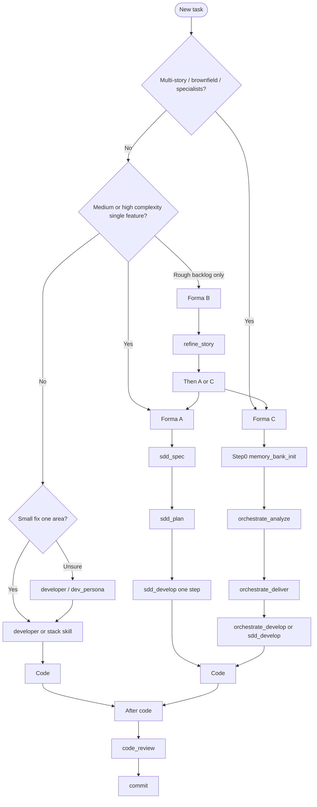

# Antigravity toolkit - user guides

Onboarding hub for **antigravity-dev-toolkit**. Start here after install — you should not need to read every `SKILL.md` under the plugin for daily work.

**Audience:** developers new to SDD in Antigravity IDE or to this toolkit.

**Language:** most guides in English; Forma C guides **10–12** are **pt-BR**. Chat replies may be pt-BR per guardrails. SDD artifacts default to pt-BR; application code stays English.

---

## What this toolkit is

A personal Antigravity IDE plugin: **Formas A / B / C** for Spec-Driven Development, stack `*_developer` shortcuts, Git flow (commit/push + GitHub **web UI** for PRs), Caveman compression, and smoke validation via `validate-all.ps1`. Deploy with `scripts/toolkit.ps1` / `sync-antigravity.ps1`; then work in any **consumer** project and invoke skills (`use skill …` / skill picker).

---

## Getting started

1. Clone and deploy — [docs/INSTALL.md](../INSTALL.md).
2. Open the **project you are building** in Antigravity.
3. Use the [decision tree](#which-skill-should-i-use), then open the matching guide.

Re-run `scripts/sync-antigravity.ps1` after `git pull`.

---

## Which skill should I use?



```
New task
  ├─ Multi-story / brownfield?   -> Forma C: memory_bank_init -> O1 -> O2 -> O3|sdd_develop
  ├─ Single medium/high feature? -> Forma A: sdd_spec -> sdd_plan -> sdd_develop
  ├─ Rough backlog item?         -> Forma B: refine_story -> checklist? -> A or C
  ├─ Small stack change?         -> developer / *_developer
  └─ After code                  -> code_review -> commit
```

---

## Formas A / B / C (what runs underneath)

| Forma | When | Pipeline | Under the hood |
|-------|------|----------|----------------|
| **A** Classic | One clear feature | `sdd_spec` → `sdd_plan` → `sdd_develop` | Direct skills; **no** memory-bank required |
| **B** Backlog | Informal bug/story | `refine_story` → `split_story_checklist` → A or C | Prepares markdown; then hand off |
| **C** Orchestrated | Multi-story / brownfield | Step 0 → O1 → O2 → O3 \| `sdd_develop` | O2 **reuses** `sdd_spec`/`sdd_plan`; O3 **reuses** `sdd_develop` (1 step/session). Orchestrators do **not** write app code |

Canonical contract: `plugin/skills/_shared/sdd_artifacts/PIPELINE.md`. Deep dive: [10 - Forma C](10-forma-c-orquestracao.md).

---

## Guide index

| Guide | Focus |
|-------|--------|
| [01-sdd-workflow.md](01-sdd-workflow.md) | Forma A under `features/NNN-slug/` |
| [02-developer.md](02-developer.md) | `developer` shortcut path |
| [03-operational-skills.md](03-operational-skills.md) | `code_review`, `repair_dotnet_build`, `test_coverage`, `commit`, `push` |
| [05-caveman-mode.md](05-caveman-mode.md) | Response compression |
| [06-developer-skills.md](06-developer-skills.md) | `refactor`, `api_integrate`, `performance_profile`, `containerize`, `i18n_manager` |
| [07-scripts-and-toolkit.md](07-scripts-and-toolkit.md) | `toolkit.ps1`, sync, validation, contracts/fixtures |
| [08-stack-developers.md](08-stack-developers.md) | Stack skills, Blip, Impeccable |
| [10-forma-c-orquestracao.md](10-forma-c-orquestracao.md) | O1/O2/O3 + memory-bank (**pt-BR**) |
| [11-forma-c-caso-nuget-extract.md](11-forma-c-caso-nuget-extract.md) | Forma C NuGet case (**pt-BR**) |
| [12-forma-c-caso-mobile-app.md](12-forma-c-caso-mobile-app.md) | Forma C mobile case (**pt-BR**) |

**Breaking:** Spec Kit guide removed. Use Formas A/B/C only.

---

## Related documentation

| Doc | Purpose |
|-----|---------|
| [../INSTALL.md](../INSTALL.md) | Install / sync |
| [../SKILLS.md](../SKILLS.md) | Skill catalog (36) |
| [../PORTABILITY.md](../PORTABILITY.md) | IDE-specific vs reusable |
| [../DESIGN-DECISIONS.md](../DESIGN-DECISIONS.md) | Design rationale |
| [../../README.md](../../README.md) | Toolkit overview |
| [../../AGENTS.md](../../AGENTS.md) | Agent contract |
